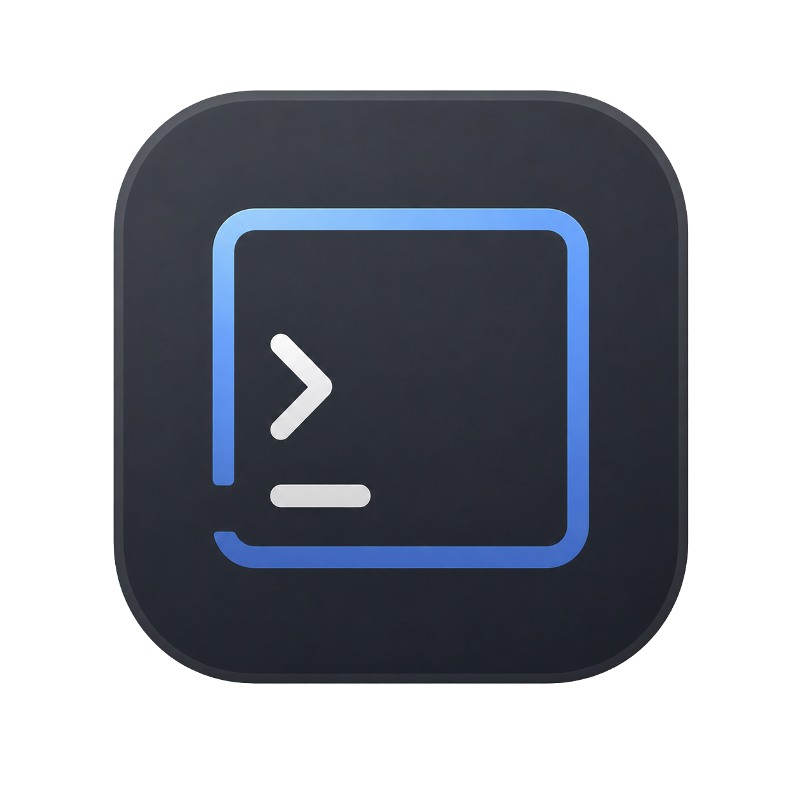

# Pane

<p align="center">
  
</p>

> A native macOS terminal for people who want a calm command line, structured command blocks, and a real persistent shell underneath.

Pane takes inspiration from modern terminal projects like [Warp](https://github.com/warpdotdev/warp), [Ghostty](https://github.com/ghostty-org/ghostty), [iTerm2](https://github.com/gnachman/iTerm2), and [Tabby](https://github.com/Eugeny/tabby), then focuses that energy into one opinionated macOS app: a continuous terminal surface, a bottom-pinned multiline composer, and a timeline of commands you can read, search, rerun, and trust.

Unlike terminals that run every command as an isolated subprocess, Pane keeps one long-running `/bin/zsh -l -i` session inside a real pseudoterminal. Your `cd`, aliases, exports, functions, virtual environments, prompt setup, Oh My Zsh configuration, and shell history all stay alive for the session.

See [DESIGN.md](DESIGN.md) for the implemented visual hierarchy, color system, spacing, and rendering boundaries.

## Why Pane?

Traditional terminals are powerful but linear. Modern block terminals are easier to scan, but they can drift away from the native terminal model. Pane is built around a simple promise:

- **Keep the shell real.** One persistent zsh process owns the session state.
- **Make commands readable.** Completed commands become structured blocks with status, timing, output, search, and rerun affordances.
- **Respect macOS.** The app uses native AppKit and SwiftUI surfaces, semantic system colors, toolbar conventions, and accessibility settings.
- **Stay honest about terminal behavior.** SwiftTerm owns the authoritative ANSI/VT buffers, alternate screen, selection, hyperlinks, mouse reporting, and scrollback.
- **Protect sensitive data by default.** Sanitization happens before command history, block output excerpts, and durable runtime state are written.

## Highlights

| Feature | What it means |
| --- | --- |
| **Structured Blocks mode** | Run commands from a multiline composer and get finalized blocks with command text, output, exit status, duration, search, copy, edit, rerun, and collapse controls. |
| **Full Terminal mode** | Switch to the authoritative SwiftTerm view whenever you want a classic terminal layout or an app needs direct byte input. |
| **Persistent zsh session** | Pane talks to one login, interactive zsh through a PTY, so shell state survives from command to command. |
| **Multi-tab workspace** | Each tab owns one persistent PTY and one authoritative SwiftTerm view, with safe metadata-only workspace restoration into fresh shells. |
| **Warm-shell autocomplete** | Suggestions come from the active zsh completion system through a private socket, with local history, executable, command, and filesystem fallback suggestions. |
| **Smart input routing** | Normal commands use the composer; secure prompts, raw mode programs, known interactive tools, and alternate-screen apps route to SwiftTerm. |
| **Alternate-screen isolation** | Full-screen TUIs such as editors and monitors stay in SwiftTerm's alternate buffer instead of polluting plain-text block transcripts. |
| **Local runtime memory** | Safe completed commands can be stored in `~/Library/Application Support/Pane/runtime-state.sqlite` for restored block history and deterministic prediction groundwork. |
| **macOS-native presentation** | Semantic colors, system accent support, native toolbar behavior, material composer surfaces, and accessibility-aware contrast/transparency behavior. |

## Product references

Pane is not a clone, but its README and product framing were refreshed with several terminal projects in mind:

- **Warp** — structured command blocks and a terminal experience designed around modern development workflows.
- **Ghostty** — a fast terminal emulator ethos with native UI and respect for the terminal as a serious rendering surface.
- **iTerm2** — a macOS terminal replacement with deep terminal features and long-standing power-user expectations.
- **Tabby** — a modern, approachable terminal that clearly explains what it is, what it is not, and how users should think about its scope.

Pane's own lane is narrower: a native macOS shell workspace that blends block readability with a single authoritative PTY-backed terminal.

## Requirements

- macOS 14 or newer
- Xcode 26 or newer with the macOS 26 SDK installed; the built app still runs on macOS 14 or newer
- Network access the first time Swift Package Manager resolves dependencies

The project pins [SwiftTerm](https://github.com/migueldeicaza/SwiftTerm) `1.14.0` exactly. App Sandbox is intentionally disabled because a useful local shell needs access to the user's executables and filesystem.

If Xcode reports a missing Metal toolchain while compiling SwiftTerm, install Apple's optional component once:

```sh
xcodebuild -downloadComponent MetalToolchain
```

## Quick start

### Run from Xcode

Open `Pane.xcodeproj` directly, not the containing folder and not `Package.swift`.

SwiftPM intentionally exposes only the non-runnable `PaneCore` library for command-line builds and tests. The `@main` app entry point, bundle identifier, signing, and macOS application lifecycle belong to the Xcode target. Opening the package alone will not offer a runnable Pane GUI product.

1. Open `Pane.xcodeproj`.
2. Let Xcode resolve SwiftTerm.
3. Select the `Pane` scheme and **My Mac**.
4. Press **Command-R** to build and run the bundled app.
5. Press **Command-U** to run the Xcode test target.

For local signing, choose your development team or use **Sign to Run Locally**. No custom entitlements are required.

### Build and test from the command line

SwiftPM supports dependency resolution, compilation of `PaneCore`, and the test suite:

```sh
swift package resolve
swift build
swift test
```

Build the macOS app bundle from a shell at a predictable DerivedData location:

```sh
DEVELOPER_DIR=/Applications/Xcode.app/Contents/Developer \
xcodebuild \
  -project Pane.xcodeproj \
  -scheme Pane \
  -configuration Debug \
  -destination 'platform=macOS' \
  -derivedDataPath "$PWD/DerivedData" \
  build
```

The resulting app is generated at:

```text
DerivedData/Build/Products/Debug/Pane.app
```

Quit any older Pane process, then launch that bundle:

```sh
open "$PWD/DerivedData/Build/Products/Debug/Pane.app"
```

SwiftPM deliberately exposes no GUI executable. Run `Pane.app` from Xcode or with `open`; do not launch `Pane.app/Contents/MacOS/Pane` directly. The bundle supplies the application identity, icon resources, and AppKit lifecycle.

## Architecture at a glance

```text
Pane/
├── App/                 # SwiftUI app entry point
├── Assets.xcassets/     # macOS app icon assets
├── Diagnostics/         # Sanitized snapshots, lifecycle ring, process metrics, and debug counters
├── Models/              # Command blocks, history, runtime state, prediction and security models
├── Performance/         # Context refresh coordination, thresholds, and signposts
├── Terminal/            # PTY session, shell integration, parser, serializer, SwiftTerm bridge
└── Views/               # Blocks timeline, composer, mode indicator, settings, and content view

Tests/
├── PaneTests/           # Unit and integration coverage for parser, sessions, state, UI helpers, and history
└── Compatibility/       # Deterministic terminal fixtures, app-hosted compatibility tests, and evidence
```

Core responsibilities:

- `TerminalSession` owns session-local PTY lifecycle through `PTYController`, command writes, resize propagation, input mode, history, block timeline, transcript filtering, and cleanup.
- `TerminalWorkspaceController` owns tab selection and lifecycle while preserving one session-local PTY and authoritative terminal view per tab.
- `PaneTerminalView` observes real buffer activation and invalidates the complete native drawing surface when the active buffer changes.
- `TerminalViewRepresentable` moves one stable AppKit host between Blocks and Full Terminal mounts without reconstructing emulator state or replaying transcripts.
- `ShellIntegration` installs additive zsh `preexec` and `precmd` hooks plus private OSC 777 markers for command lifecycle detection.
- `BlockStreamParser` strips private markers from captured output and updates working directory, exit status, and timing metadata.
- `CommandAutocomplete` combines warm-shell `compsys` capture with bounded local history, command, executable, and filesystem suggestions.
- `TerminalSecurityState` follows PTY ECHO state so password prompts and secure reads bypass prediction and persistence paths.
- `SensitiveDataSanitizer` is the shared redaction boundary for commands, output, errors, and allowlisted environment values.
- `RuntimeStatePersistenceCoordinator` shares one `SQLiteRuntimeStateStore` handle across tabs; the store provides WAL-backed, schema-versioned storage with age, count, and size retention.

PTY bytes intentionally have two destinations:

1. Every byte is fed exactly once to SwiftTerm, which owns the live normal and alternate terminal buffers.
2. A filtered copy is parsed into plain-text command blocks. Alternate-screen frames never enter that transcript.

## How Pane feels to use

### Blocks mode

Pane opens in Blocks mode. Type into the bottom composer, press Return, and Pane writes your draft to the persistent PTY. While a command is running, the composer becomes the active command surface: it shows the command, elapsed time, a compact read-only terminal mirror, and a line-oriented stdin editor when appropriate.

When the command completes, is interrupted, or the shell exits, Pane finalizes the output into a block in the timeline above the composer. Blocks are bottom-anchored, searchable, collapsible, copyable, editable, and rerunnable when the command is safe to retain.

Multiline shell input is handled as one command lifecycle. If zsh requests more syntax before `preexec`—for example after `if true; then`—Pane shows **Continue the command…** and appends each submitted continuation line to the same queued command.

### Direct input and Full Terminal

Pane keeps input routing separate from layout. Most commands use the composer. Programs that need direct bytes, raw mode, secure input, or alternate-screen rendering receive the authoritative SwiftTerm surface instead. You can also switch manually with **Command-Shift-I**.

Known interactive tools such as Codex, Claude, OpenCode, `vim`, `ssh`, Python, and `top` request direct input. Alternate-screen TUIs expand into the main active-block workspace. Full Terminal remains sticky until you leave it.

### Autocomplete

Autocomplete appears when the shell is idle and the caret follows a non-whitespace token. Pane asks the active zsh for context-sensitive candidates over a private Unix-domain socket, never through the visible PTY. If warm-shell capture is unavailable, slow, malformed, or too large, Pane falls back to local history, command, executable, and filesystem suggestions.

### Runtime state

Eligible completed commands and block metadata are written asynchronously to local SQLite storage. On launch, Pane marks stale active records interrupted, restores bounded durable block history behind a session boundary, validates the previous directory, and starts a fresh shell there or falls back to the home directory.

Pane never resurrects a PTY, foreground process, alternate-screen buffer,
secure draft, secure input, raw terminal byte stream, or automatically executes
a restored command. Workspace restoration may retain only a bounded,
non-secure composer draft and always places it in a fresh shell.

## Keyboard shortcuts

| Shortcut | Action |
| --- | --- |
| **Return** | Accept the highlighted autocomplete suggestion; otherwise run an idle draft or send one line to the active command |
| **Shift-Return** | Insert a composer newline |
| **Tab / Shift-Tab** | Stage a lone suggestion, or select the next / previous candidate when several are visible |
| **Escape** | Dismiss visible autocomplete suggestions; otherwise use normal text behavior |
| **Up / Down** | Navigate session command history while no command is active |
| **Command-Shift-I** | Open Full Terminal mode |
| **Command-Shift-D** | Focus Direct Input, embedded in an active block when available |
| **Command-Shift-S** | Enter or exit manual Secure Input |
| **Command-Up / Command-Down** | Select the previous / next block |
| **Command-Return** | Place the selected safe command in the composer |
| **Command-E** | Put the selected command in the composer |
| **Control-C** | Interrupt the active Blocks command, or send `ETX` directly in Terminal mode |
| **Control-D** | Send `EOT` to the active Blocks command, or directly in Terminal mode |
| **Command-K** | Clear blocks or the terminal for the current mode |
| **Command-Shift-R** | Restart the login shell |

Option acts as Meta in Terminal mode. The native toolbar and **Terminal** menu expose the primary mode and lifecycle actions without requiring pointer input.

Each tab keeps an isolated shell, terminal buffer, command timeline, completion
generation, focus target, and secure-input state. Workspace restoration stores
only bounded safe metadata and always creates fresh shells.

## Terminal behavior

- SwiftTerm provides ANSI/VT rendering, selection, copy and paste, hyperlinks, mouse reporting, alternate buffers, and 10,000 lines of scrollback.
- SwiftTerm `LocalProcess` uses `forkpty`; ordinary pipes are not used.
- Window changes update the emulator and PTY using `TIOCSWINSZ`, only when dimensions actually change.
- Shell exit interrupts unfinished blocks, restores the normal terminal buffer, and exposes **Restart Shell**.
- Restart warns for a foreground process, terminates the old shell before starting a new `/bin/zsh -l -i` session, preserves completed blocks, and shows a restart boundary.
- Closing the final window quits the app; application termination stops the shell and closes PTY I/O without publishing teardown state through a disappearing SwiftUI view.
- `TERM` defaults to `xterm-256color`, `COLORTERM` to `truecolor`, and `TERM_PROGRAM` to `Pane`.

## Known limitations

- The active-command live mirror is presentation-only. It does not own the PTY, resize it, send terminal replies, or accept keyboard and mouse input.
- Completed blocks use Pane's sanitized plain-text presentation for consistent block typography, search, copy, accessibility, and persistence.
- Running non-alternate-screen interactive commands may host Pane's one authoritative terminal directly. When they finish, the block returns to the same clean plain-text presentation as other commands.
- Commands typed directly in Full Terminal become structured blocks only when Pane's zsh lifecycle hooks identify command start, completion, directory, and exit status.
- Up and Down navigate command history rather than moving the caret vertically in a multiline draft.
- Durable session and finalized-block restoration are wired. Local completion now detects bounded project context, surfaces manifest/Make/Just scripts, and ranks deterministic evidence without running project code. Learned command transitions, semantic retrieval, and an optional local model remain future prediction phases.
- Replacing zsh with `exec`, removing integration hooks, or redefining them can prevent completion markers and leave a block running until interruption, shell exit, or restart.
- Warm-shell autocomplete depends on zsh socket, ZLE, PTY, and completion modules. Pane falls back to less context-aware local suggestions when capture is unavailable.
- Automatic input classification combines alternate-screen, process-group, termios, and bounded process-name signals. Manual Full Terminal selection remains authoritative until you leave it.
- Pane supports a single-window multi-tab workspace. Split panes, multiple
  windows, detachable tabs, generated AI predictions, synchronization,
  remote-session reconnection, and cloud export are not implemented.

## Project status

Pane is a focused macOS terminal experiment. The foundation is in place: isolated persistent PTYs across a multi-tab workspace, structured blocks, native UI, durable safe history, shell-authoritative completion capture, project-aware local fallback, secure-input routing, and terminal-mode escape hatches.

P2 hardens that foundation for daily-driver use through compatibility,
multi-session, resource, large-output, and recovery testing. See
[the compatibility dashboard](docs/compatibility.md) and
[the P2 release-validation checklist](docs/p2-release-validation.md). The next
roadmap step after P2 is **essential settings and distribution**, not split
panes or MLX completion.
